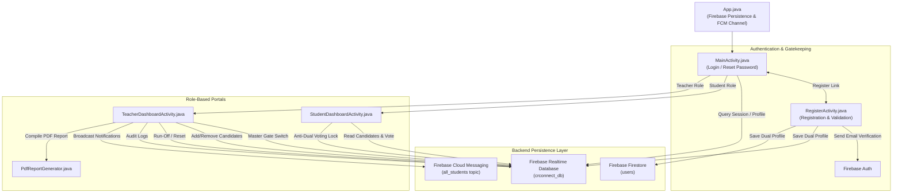

# Architectural & Technical Summary: CRConnect Android App

## Executive Overview
**CRConnect** is a full-featured, secure, real-time Class Representative (CR) Election and Department Network application built for Bangladesh University of Business and Technology (BUBT). The application provides role-based workflows for **Students** and **Teachers/Admins**, leveraging Firebase Cloud Infrastructure for real-time data sync, security logging, push notifications, and automated official election report compilation.

---

## Technical Stack & Architecture

| Layer | Technology / Library | Details |
| :--- | :--- | :--- |
| **Language & SDK** | Java 11 / Android SDK 35 | Built using Android SDK 35 (minSdk 24) with Java 11 target compatibility. |
| **UI Paradigm** | Android XML + Material Design 3 | Glassmorphic dark theme, Google-style true edge-to-edge system bars, dynamic keyboard scaling, and responsive Material Card views. |
| **Backend & Sync** | Firebase Realtime Database | Real-time live data syncing with offline disk persistence enabled (`setPersistenceEnabled(true)`). |
| **Document Store** | Firebase Firestore | Dual-persistence user profile mirror for distributed querying. |
| **Authentication** | Firebase Auth | Domain-enforced authentication requiring official `@bubt.edu.bd` or `@cse.bubt.edu.bd` emails with mandatory email verification. |
| **Push Notifications**| Firebase Cloud Messaging (FCM) | Topic-based broadcast (`all_students`) and foreground live listener snackbar notifications. |
| **Session Cache** | SharedPreferences (`SessionManager`) | Encapsulated local caching for fast initial app render, dark mode state, and offline profile details. |
| **Image Loading** | Glide 4.16.0 | Image processing, circle crops, Base64 decoding, and candidate photo caching. |
| **PDF Engine** | `android.graphics.pdf.PdfDocument` | Native 2D canvas drawing engine for official A4 report generation, native Android Print Spooler interop, and FileProvider URI sharing. |

---

## Architectural Layout & Flow Diagram



---

## Key Components & Codebase Structure

### 1. Application Setup & Session Management
- **[`App.java`](file:///C:/Users/shadd/StudioProjects/CRConnect-App/app/src/main/java/com/example/crconnect/App.java)**:
  - Application entry point enabling offline disk persistence (`FirebaseDatabase.getInstance().setPersistenceEnabled(true)`).
  - Initializes FCM high-priority notification channel (`crconnect_notifications_channel`).
- **[`SessionManager.java`](file:///C:/Users/shadd/StudioProjects/CRConnect-App/app/src/main/java/com/example/crconnect/SessionManager.java)**:
  - Centralized manager for `SharedPreferences` (`CRConnectSession`).
  - Stores user profile information (`userID`, `userEmail`, `userName`, `userRole`, `userSection`, `userIntake`, `userDept`, `profileImageUrl`, `darkMode`).

### 2. Authentication & User Onboarding
- **[`MainActivity.java`](file:///C:/Users/shadd/StudioProjects/CRConnect-App/app/src/main/java/com/example/crconnect/MainActivity.java)**:
  - Serves as the launcher activity with true edge-to-edge transparent system bars (`WindowCompat.setDecorFitsSystemWindows(getWindow(), false)`).
  - Handles login with auto-login session routing based on user role (`Student` vs. `Teacher/Admin`).
  - Strictly verifies email domain (`@bubt.edu.bd` or `@cse.bubt.edu.bd`) and email verification status (`isEmailVerified()`).
  - Features an interactive BottomSheetDialog for password reset links via `FirebaseAuth.sendPasswordResetEmail()`.
  - Responsive layout scaling with keyboard listeners on the branding container and smooth auto-scroll.
- **[`RegisterActivity.java`](file:///C:/Users/shadd/StudioProjects/CRConnect-App/app/src/main/java/com/example/crconnect/RegisterActivity.java)**:
  - Multi-role signup supporting student-specific fields (`Student ID`, `Intake`, `Section`, `Department`) and teacher-specific fields (`Teacher Code`).
  - Strict input validation pipelines:
    - **Full Name**: Regex check (`^[a-zA-Z.\\s-]+$`), 3–50 chars, dummy text filter (`test`, `dummy`, `qwerty`, `habijabi`).
    - **Email**: Official BUBT email domain check (`@bubt.edu.bd`, `@cse.bubt.edu.bd`).
    - **Student ID / Teacher Code**: Numeric BUBT ID format or alphanumeric teacher code regex.
    - **Password**: Strong requirement (minimum 8 chars with letters & numbers).
  - Dual data persistence writing to both Firebase Realtime Database (`crconnect_db/users`) and Firebase Firestore (`users`).
  - Dispatches email verification link (`sendEmailVerification()`) and presents a success card.

### 3. Student Portal
- **[`StudentDashboardActivity.java`](file:///C:/Users/shadd/StudioProjects/CRConnect-App/app/src/main/java/com/example/crconnect/StudentDashboardActivity.java)**:
  - Student profile header with profile picture upload (Base64 encoded and synced across Firebase nodes).
  - Live state tracking for:
    - `master_voting_enabled`: Dynamically updates voting gate UI (OPEN vs. LOCKED).
    - `voters/{studentId}`: Anti-dual voting security mechanism ensuring one student can vote exactly once.
  - Candidate list rendered dynamically with:
    - Rank badges (🥇 1st Place, 🥈 2nd Place, 🥉 3rd Place) and neon borders.
    - Graphical vote distribution progress bar.
    - Manifesto BottomSheetDialog on tap.
  - Real-time listener for admin broadcast notifications (`broadcast_notifications` node and FCM `all_students` topic).

### 4. Admin / Teacher Console
- **[`TeacherDashboardActivity.java`](file:///C:/Users/shadd/StudioProjects/CRConnect-App/app/src/main/java/com/example/crconnect/TeacherDashboardActivity.java)**:
  - **Live Election Statistics**: Displays total votes cast, registered voters count, and estimated turnout percentage.
  - **Master Voting Gate Switch**: Instantly toggles global student voting access and dispatches push notifications.
  - **Candidate Management**: Form to publish candidates with custom photo selection, manifesto, and department details.
  - **Run-Off Initialization**: Resets all vote counts to 0 while maintaining candidates for tie-breaker election rounds.
  - **Full Reset Action**: Deletes candidates and voter logs with glassmorphic confirmation sheets.
  - **Audit Logging**: Logs every admin action (`audit_logs`) with teacher details and server timestamps.
  - **PDF Export Engine**: Compiles and exports election reports via `PdfReportGenerator`.

### 5. Services & Utilities
- **[`MyFirebaseMessagingService.java`](file:///C:/Users/shadd/StudioProjects/CRConnect-App/app/src/main/java/com/example/crconnect/MyFirebaseMessagingService.java)**:
  - Handles push notification payloads from Firebase Cloud Messaging.
  - Builds high-priority notifications with vibration and sound.
- **[`PdfReportGenerator.java`](file:///C:/Users/shadd/StudioProjects/CRConnect-App/app/src/main/java/com/example/crconnect/PdfReportGenerator.java)**:
  - Canvas-driven PDF document generation engine formatted for A4 pages.
  - Draws institution header, report metadata, executive metrics card, candidate ranking table with winner highlight badge, and security verification footer.
  - Integrates with Android Print Spooler (`PrintDocumentAdapter`) and FileProvider (`Intent.ACTION_SEND` and `Intent.ACTION_VIEW`).

---

## Database Schemas (Firebase Realtime Database)

```json
{
  "crconnect_db": {
    "users": {
      "{uid|sanitizedId|sanitizedEmail}": {
        "name": "Full Name",
        "email": "user@bubt.edu.bd",
        "id": "20211103001",
        "role": "Student | Teacher/Admin",
        "section": "55/8",
        "intake": "55",
        "dept": "Department of CSE, BUBT",
        "profileImageUrl": "base64_encoded_string",
        "deviceId": "android_id"
      }
    },
    "candidates": {
      "{candidateId}": {
        "name": "Candidate Name",
        "votes": 12,
        "imageUrl": "base64_encoded_string",
        "dept": "Department of CSE, BUBT",
        "manifesto": "Committed to student welfare..."
      }
    },
    "voters": {
      "{sanitizedStudentId}": "{candidateId_voted_for}"
    },
    "master_voting_enabled": true,
    "audit_logs": {
      "{logId}": {
        "teacherName": "Teacher Name",
        "teacherEmail": "teacher@bubt.edu.bd",
        "teacherId": "CSE-101",
        "action": "Action description",
        "timestamp": 1711234567890
      }
    },
    "broadcast_notifications": {
      "title": "Notification Title",
      "body": "Notification Body",
      "actionType": "GATE_CONTROL | NEW_CANDIDATE | RUN_OFF | RESET",
      "sender": "Teacher Name",
      "timestamp": 1711234567890
    }
  }
}
```

---

## Summary of UI Layout XML Files

1. **[`activity_main.xml`](file:///C:/Users/shadd/StudioProjects/CRConnect-App/app/src/main/res/layout/activity_main.xml)**: Login screen with BUBT logo branding, role selection RadioGroup, Outlined Text Input Layouts with Neon Cyan borders (`#38BDF8`), Sign In button, and links for Password Reset and Registration.
2. **[`activity_register.xml`](file:///C:/Users/shadd/StudioProjects/CRConnect-App/app/src/main/res/layout/activity_register.xml)**: Glassmorphic registration form with dynamic field switching (Student vs. Teacher), filled text boxes, and success state card.
3. **[`activity_student_dashboard.xml`](file:///C:/Users/shadd/StudioProjects/CRConnect-App/app/src/main/res/layout/activity_student_dashboard.xml)**: Student portal containing student profile card, live voting status badge, and scrollable candidate cards list.
4. **[`activity_teacher_dashboard.xml`](file:///C:/Users/shadd/StudioProjects/CRConnect-App/app/src/main/res/layout/activity_teacher_dashboard.xml)**: Admin portal with live election statistics metrics card, PDF export button, Master Voting Gate switch, Candidate creation card with photo picker, advanced controls (Run-off and Reset), and published candidates list.
5. **[`include_header.xml`](file:///C:/Users/shadd/StudioProjects/CRConnect-App/app/src/main/res/layout/include_header.xml)**: Shared header layout with circular user profile image, dashboard titles, live security status pill, and logout icon button.
6. **[`dialog_pdf_ready.xml`](file:///C:/Users/shadd/StudioProjects/CRConnect-App/app/src/main/res/layout/dialog_pdf_ready.xml)**: BottomSheetDialog interface presenting choices to Print/Save, Share, or Open the generated election PDF report.

---

## Security & Reliability Features

1. **Email Domain Enforcement**: Restricted to official BUBT domains (`@bubt.edu.bd` and `@cse.bubt.edu.bd`).
2. **Email Verification Gate**: Mandatory account activation link verification before accessing dashboards.
3. **Anti-Dual Voting Security**: Immutable voter registry mapping student ID to candidate ID in `voters` node.
4. **Input Anti-Gibberish Filtering**: Rejects dummy names, emails, and passwords (`test`, `dummy`, `qwerty`, `habijabi`).
5. **Real-time Master Gate Control**: Teachers can instantaneously lock or unlock election participation.
6. **Audit Trail**: Every administrative action (enabling/disabling voting, adding candidates, running tie-breakers, resetting data, exporting PDFs) is stored with server timestamps.
7. **Offline Persistence**: Firebase offline capability allows seamless operation even with intermittent network connectivity.
